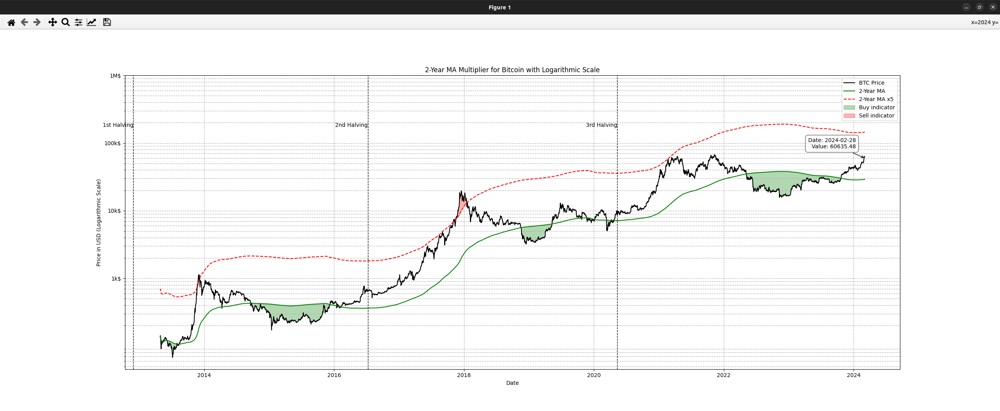

# README for the 2-Year MA Multiplier Chart Script - Update



## Overview
This updated script generates a chart visualizing the Bitcoin (BTC) price, its 2-Year Moving Average (MA), and a multiplier of the 2-Year MA (specifically, the 2-Year MA multiplied by 5). This visualization aims to identify potential market cycles in the Bitcoin market, offering insights into periods of undervaluation or overvaluation relative to historical averages.

The utilization of the 2-Year MA and its multiplier stems from the concept that long-term moving averages help smooth out price data over time, providing a clearer view of the overall trend. The multiplier creates a band above the 2-Year MA, suggesting potential sell points when the price exceeds this band, indicative of overvaluation. Conversely, when the price is beneath the 2-Year MA, it may signal undervaluation, suggesting a potentially favorable buying opportunity.

## Installation and Usage

### Libraries Used
The script requires `requests`, `pandas`, `matplotlib`, and `mplcursors`. Ensure these are installed using Pip:

```bash
pip install requests pandas matplotlib mplcursors
```

### Running the Script
Execute the script with the desired parameters:

```bash
python 2yeargraph.py bitcoin usd "2018-01-01" "2024-03-05"
```

Ensure to replace `2yeargraph.py` with your script's filename.

## Understanding the Chart
The chart displays:
- **BTC Price**: Daily Bitcoin price.
- **2-Year MA**: The long-term trend through the 2-Year Moving Average.
- **2-Year MA x5**: Indicates potential overvaluation regions.
- **Green Shaded Areas**: When the price is below the 2-Year MA, suggesting undervaluation and potential buy periods.
- **Red Shaded Areas**: When the price is above the 2-Year MA x5, suggesting overvaluation and potential sell periods.

### Interactive Features
Hover over the chart to see detailed values for any date, enhancing the analytical utility of the visualization.

## Credits and Inspiration
The chart concept is inspired by "Bitcoin Investor Tool: 2-Year MA Multiplier" from [LookIntoBitcoin](https://www.lookintobitcoin.com/charts/bitcoin-investor-tool/), which provides analytical tools for Bitcoin market analysis. This tool helps investors identify buy and sell opportunities based on historical price movements and trends.

## Conclusion
This script and its visualization aid investors and cryptocurrency enthusiasts in understanding market cycles for informed decision-making. It's important to consider that historical data, while insightful, is just one aspect of comprehensive investment decision-making.